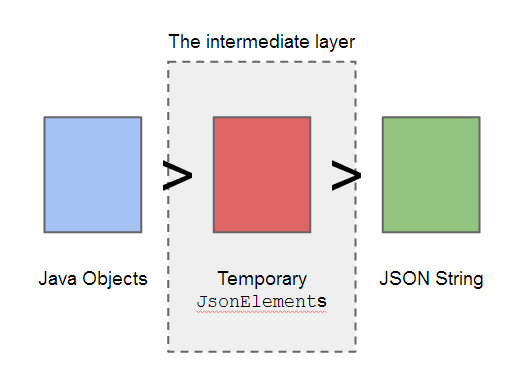
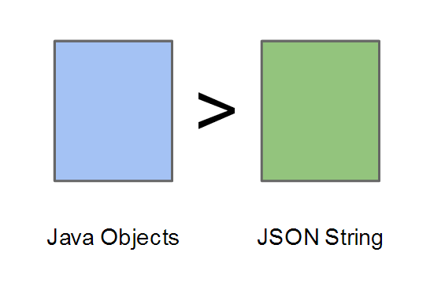
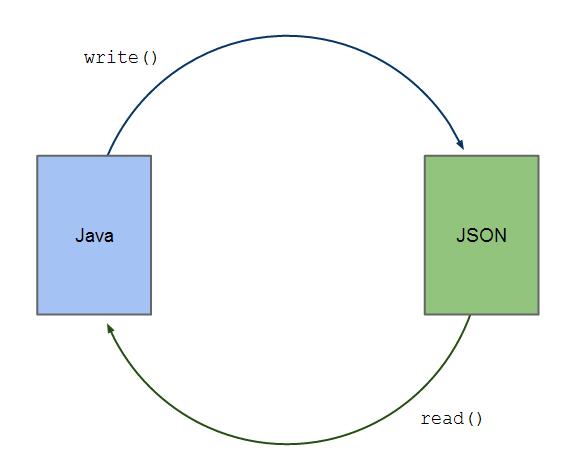

Java objects can be serialised to JSON strings and deserialised back using `JsonSerializer` ([Article](http://www.javacreed.com/gson-serialiser-example/) and [Java Doc](https://google.github.io/gson/apidocs/com/google/gson/JsonSerializer.html)) and the `JsonDeserializer` ([Article](http://www.javacreed.com/gson-deserialiser-example/) and [Java Doc](https://google.github.io/gson/apidocs/com/google/gson/JsonDeserializer.html)) respectively.   These two classes simplify the translation between these two realms but add an extra layer which can be avoided.  Instead of the `JsonSerializer` or `JsonDeserializer` we can use an instance of `TypeAdapter` ([Java Doc](https://google.github.io/gson/apidocs/com/google/gson/TypeAdapter.html)) which can serialise and deserialise JSON objects efficiently as we will see in this article.  

This article assumes that the reader is already familiar with Gson and encourages the reader to read the following articles before proceeding:

1. [Simple Gson Example](/simple-gson-example/)
1. [Gson Deserialiser Example](/gson-deserialiser-example/)
1. [Gson Serialiser Example](/gson-serialiser-example/)

Most of the examples will not contain the whole code and may omit fragments which are not relevant to the example being discussed. The readers can download or view all code from the above link.

## Introduction

The `JsonSerializer` and `JsonDeserializer` classes makes use of  an intermediate layer of objects.  The Java or JSON objects are first converted to `JsonElement` (the intermediate layer) and then converted to Java or JSON string as shown in the following image.



This intermediate layer can be avoided by using the `TypeAdapter` instead of `JsonSerializer` or `JsonDeserializer`.  The `TypeAdapter` is more efficient than the  `JsonSerializer` and `JsonDeserializer` as it skips the intermediate layer.  This fact is also documented in the class Java Doc.

> New applications should prefer TypeAdapter, whose streaming API is more efficient than this interface's tree API. ([reference](https://google.github.io/gson/apidocs/com/google/gson/JsonSerializer.html))

With that said, the `JsonSerializer` and `JsonDeserializer` provide a safety cushion which is very convenient as it mitigates the risk of producing invalid JSON strings.  The image shown above shows how objects are serialised using the `JsonSerializer`.  The Java objects are converted to `JsonElement`s first, and then converted to JSON string.  This process creates a set of temporary objects which are then converted to JSON string.   These objects are converted to JSON string using an internal implementation of the `TypeAdapter`.   The `TypeAdapter` can take any Java object (including objects of type `JsonElement`) and converts it to JSON string as shown in the following image.



The `TypeAdapter` is an abstract class at has two abstract methods.   The `write()` ([Java Doc](https://google.github.io/gson/apidocs/com/google/gson/TypeAdapter.html#write-com.google.gson.stream.JsonWriter-T-)) method takes an instance of the `JsonWriter` ([Java Doc](https://google.github.io/gson/apidocs/com/google/gson/stream/JsonWriter.html)) and the object to be serialised.  The object is written to the `JsonWriter` in a similar manner an object is printed to a `PrintStream` ([Java Doc](http://docs.oracle.com/javase/7/docs/api/java/io/PrintStream.html)).  The `read()` ([Java Doc](https://google.github.io/gson/apidocs/com/google/gson/TypeAdapter.html#read-com.google.gson.stream.JsonReader-)) method takes an instance of the `JsonReader` ([Java Doc](https://google.github.io/gson/apidocs/com/google/gson/stream/JsonReader.html)) and returns an instance of the deserialised object.



Similar to the `JsonSerializer` and `JsonDeserializer`, the `TypeAdapter` needs to be registered, as shown in the following code fragment, before it can be used.

```java
    final GsonBuilder gsonBuilder = new GsonBuilder();
    gsonBuilder.registerTypeAdapter(Book.class, new BookTypeAdapter());
    final Gson gson = gsonBuilder.create();
```

In the following sections we will see how to use the `TypeAdapter` to serialise Java objects into JSON strings and deserialise them back in more detail.

## Simple TypeAdapter Example

Consider the following class.

```java
package com.javacreed.examples.gson.part1;

public class Book {

  private String[] authors;
  private String isbn;
  private String title;

  /* Methods removed for brevity */
}
```

This class has three fields one of which is an array of `String`.  The following class shows an example of a `TypeAdapter`, named `BookTypeAdapter`, that can serialise and deserialise instances of the `Book` class shown above.

```java
package com.javacreed.examples.gson.part1;

import java.io.IOException;

import org.apache.commons.lang3.StringUtils;

import com.google.gson.TypeAdapter;
import com.google.gson.stream.JsonReader;
import com.google.gson.stream.JsonWriter;

public class BookTypeAdapter extends TypeAdapter<Book> {

  @Override
  public Book read(final JsonReader in) throws IOException {
    final Book book = new Book();

    in.beginObject();
    while (in.hasNext()) {
      switch (in.nextName()) {
      case "isbn":
        book.setIsbn(in.nextString());
        break;
      case "title":
        book.setTitle(in.nextString());
        break;
      case "authors":
        book.setAuthors(in.nextString().split(";"));
        break;
      }
    }
    in.endObject();

    return book;
  }

  @Override
  public void write(final JsonWriter out, final Book book) throws IOException {
    out.beginObject();
    out.name("isbn").value(book.getIsbn());
    out.name("title").value(book.getTitle());
    out.name("authors").value(StringUtils.join(book.getAuthors(), ";"));
    out.endObject();
  }
}
```

This class may look cryptic.  Let us split it in smaller parts and describe each part individually.

### The write() Method

The `write()` method takes two parameters.  The first parameter is the `JsonWriter` instance, where the book will be written.  This can be thought of as a `PrintStream` that has special methods that will allow us to construct a valid JSON string.  In the event we make a mistake and attempt to produce an invalid JSON string, the `JsonWriter` will throw an `IllegalStateException` ([Java Doc](http://docs.oracle.com/javase/7/docs/api/java/lang/IllegalStateException.html)) indicating that the last action was not valid.  The second parameter represents the object to be serialised, which can be `null`.

```java
  @Override
  public void write(final JsonWriter out, final Book book) throws IOException {
    out.beginObject();
    out.name("isbn").value(book.getIsbn());
    out.name("title").value(book.getTitle());
    out.name("authors").value(StringUtils.join(book.getAuthors(), ";"));
    out.endObject();
  }
```

The `JsonWriter` method provides specific methods that can be used to construct a JSON objects.  Here we are using some.

1. The book will be represented as a JSON object thus we start with the `beginObject()` ([Java Doc](https://google.github.io/gson/apidocs/com/google/gson/stream/JsonWriter.html#beginObject--)) method call.

    ```java
        out.beginObject();
    ```

    The above call will produce the following JSON output

    ```java
    {
    ```

    If instead we want to create a JSON array, then we need to use the `beginArray()` ([Java Doc](https://google.github.io/gson/apidocs/com/google/gson/stream/JsonWriter.html#beginArray--)) instead, which indicates that beginning of an array.  

    Please note that we need to start with either a JSON object or a JSON array.  JSON data must be contained in one of these.

1. The `beginObject()` allows us to add the required fields.  Note that we cannot add the fields without first calling the `beginObject()`.  A field must have a _name_ and a _value_, which value can be `null`.  This can be achieved by invoking the `name()` ([Java Doc](https://google.github.io/gson/apidocs/com/google/gson/stream/JsonWriter.html#name-java.lang.String-)) method followed by the `value()` ([Java Doc](https://google.github.io/gson/apidocs/com/google/gson/stream/JsonWriter.html#value-java.lang.String-)) method.

    ```java
        out.name("isbn").value(book.getIsbn());
    ```

    The above code fragment will produce the following highlighted JSON output.  Please note that the curly bracket was produced by the `beginObject()` described before.

    ```java
    {
      "isbn": "978-0321336781"
    ```

    Here we used, what is referred to as, method chaining ([Wiki](http://en.wikipedia.org/wiki/Method_chaining)) which allows us to have the name and value on one line.  Please note that we could have written the above as shown next.

    ```java
        out.name("isbn").
        out.value(book.getIsbn());
    ```

    Both examples will produce the same result.

1. The book title and the authors are added in a similar fashion.

    ```java
        out.name("title").value(book.getTitle());
        out.name("authors").value(StringUtils.join(book.getAuthors(), ";"));
    ```

    The above code fragment will produce the following highlighted JSON output, which is appended to the JSON     produced so far.

    ```java
    {
      "isbn": "978-0321336781",
      "title": "Java Puzzlers: Traps, Pitfalls, and Corner Cases",
      "authors": "Joshua Bloch;Neal Gafter"
    ```

    Please note that the authors are added as a single string joined by a semi-colon using the Apache Commons Lang library ([Homepage](http://commons.apache.org/proper/commons-lang/)) class `StringUtils` ([Java Doc](http://commons.apache.org/proper/commons-lang/apidocs/org/apache/commons/lang3/StringUtils.html)) to keep this first example as simple as possible.

1. Finally, we need to close the JSON object by invoking the following method.

    ```java
        out.endObject();
    ```

    The above call will produce the following highlighted JSON output

    ```
    {
      "isbn": "978-0321336781",
      "title": "Java Puzzlers: Traps, Pitfalls, and Corner Cases",
      "authors": "Joshua Bloch;Neal Gafter"
    }
    ```

    It is very important to close the JSON object as otherwise we will produce an invalid JSON string.      Unfortunately, no exceptions will be thrown at this stage, but it will fail during reading with a     `JsonSyntaxException` ([Java Doc](https://google.github.io/gson/apidocs/com/google/gson/JsonSyntaxException.html)) similar to the one shown below.

    ```
    Exception in thread "main" com.google.gson.JsonSyntaxException: java.io.EOFException: End of input at line 4     column 40
    	at com.google.gson.Gson.fromJson(Gson.java:813)
    	at com.google.gson.Gson.fromJson(Gson.java:768)
    	at com.google.gson.Gson.fromJson(Gson.java:717)
    	at com.google.gson.Gson.fromJson(Gson.java:689)
    	at com.javacreed.examples.gson.part1.Main.main(Main.java:41)
    Caused by: java.io.EOFException: End of input at line 4 column 40
    	at com.google.gson.stream.JsonReader.nextNonWhitespace(JsonReader.java:1377)
    	at com.google.gson.stream.JsonReader.doPeek(JsonReader.java:471)
    	at com.google.gson.stream.JsonReader.hasNext(JsonReader.java:403)
    	at com.javacreed.examples.gson.part1.BookTypeAdapter.read(BookTypeAdapter.java:33)
    	at com.javacreed.examples.gson.part1.BookTypeAdapter.read(BookTypeAdapter.java:1)
    	at com.google.gson.Gson.fromJson(Gson.java:803)
    	... 4 more
    ```

Consider the following `Book` instance.

```java
    final Book book = new Book();
    book.setAuthors(new String[] { "Joshua Bloch", "Neal Gafter" });
    book.setTitle("Java Puzzlers: Traps, Pitfalls, and Corner Cases");
    book.setIsbn("978-0321336781");
```

When serialised with the above `BookTypeAdapter` we will produce the following JSON.

```
{
  "isbn": "978-0321336781",
  "title": "Java Puzzlers: Traps, Pitfalls, and Corner Cases",
  "authors": "Joshua Bloch;Neal Gafter"
}
```

This concludes our description of the `write()` method.  In the following section we will see how the `read()` works.

### The read() Method

The `TypeAdapter` has another abstract method, which purpose is to convert JSON string into Java Objects.  The `read()` method takes an instance of `JsonReader` and creates the Java Object from it as shown in the following fragment.

```java
  @Override
  public Book read(final JsonReader in) throws IOException {
    final Book book = new Book();

    in.beginObject();
    while (in.hasNext()) {
      switch (in.nextName()) {
      case "isbn":
        book.setIsbn(in.nextString());
        break;
      case "title":
        book.setTitle(in.nextString());
        break;
      case "authors":
        book.setAuthors(in.nextString().split(";"));
        break;
      }
    }
    in.endObject();

    return book;
  }
```

This method will take the parsed JSON string as an instance of `JsonReader` and converts it back to an instance of `Book`.  The `JsonReader` is very similar to an `InputStream` ([Java Doc](http://docs.oracle.com/javase/7/docs/api/java/io/InputStream.html)).  It reads JSON parts, so to call them, sequentially.  The `JsonReader` can peek but it cannot skip to a given part without first reading all preceding JSON parts.

The `read()` method can appear more complex than its counterpart because it involves more control logic.  Let us break this down further and understand each individual part.

1. We have a JSON object that includes three fields as shown below.

    ```
    {
      "isbn": "978-0321336781",
      "title": "Java Puzzlers: Traps, Pitfalls, and Corner Cases",
      "authors": "Joshua Bloch;Neal Gafter"
    }
    ```

    The first thing we need to do is to read the object as shown next.

    ```java
        in.beginObject();
    ```

    This will read the curly brackets, highlighted below, and will allow us to read the name/values within the JSON object.

    ```
    {
      "isbn": "978-0321336781",
      "title": "Java Puzzlers: Traps, Pitfalls, and Corner Cases",
      "authors": "Joshua Bloch;Neal Gafter"
    }
    ```

1. A JSON object contains a list of name/value pairs.  Using the `JsonReader` we cannot read a particular field by its name, as we can do with the `JsonDeserializer`.  We cannot, for example, read the book title before we first reading its ISBN.

    We need to invoke the `nextName()` method first to read the next field name.  Then we can read the field value by invoking the `nextString()` method as shown in the following example.

    ```java
      String name = in.nextName();
      String value = in.nextString();
    ```

    We cannot skip the name, even though we know that the book ISBN is the first field.  If we do so (that is, skip the invocation of the `nextName()` method), an error similar to the following will be thrown

    ```
    Caused by: java.lang.IllegalStateException: Expected a string but was NAME at line 2 column 4
    	at com.google.gson.stream.JsonReader.nextString(JsonReader.java:821)
    	at com.javacreed.examples.gson.part1.BookTypeAdapter.read(BookTypeAdapter.java:32)
    	at com.javacreed.examples.gson.part1.BookTypeAdapter.read(BookTypeAdapter.java:1)
    	at com.google.gson.Gson.fromJson(Gson.java:803)
    	... 4 more
    ```

1. The `JsonReader` has another method called `hasNext()` ([Java Doc](https://google.github.io/gson/apidocs/com/google/gson/stream/JsonReader.html#hasNext--)), which returns `true` if more name/value pairs are available, `false` otherwise.  Combining this within a loop and a switch control statement we can have a generic method for deserialising objects.

    ```java
        while (in.hasNext()) {
          switch (in.nextName()) {
          }
        }
    ```

    In a nutshell, the above code fragment iterates through all name/value pairs and then using the switch statement is filters the fields but their names.  The method `nextName()` returns the name of the next field.  We need to create a case statement for every possible field and assign the correct logic.  The following code fragment shows the complete parsing process.

    ```java
        while (in.hasNext()) {
          switch (in.nextName()) {
          case "isbn":
            book.setIsbn(in.nextString());
            break;
          case "title":
            book.setTitle(in.nextString());
            break;
          case "authors":
            book.setAuthors(in.nextString().split(";"));
            break;
          }
        }
    ```

    This approach is quite generic and it does not depend on the order of the fields.   Unfortunately it is quite verbose and can get messy especially when dealing with large objects.

1. Once all fields are parsed, we need to close the JSON object by invoking the `endObject()` method.

    ```java
        in.endObject();
    ```

    Failing to do so will cause an `JsonIOException` ([Java Doc](https://google.github.io/gson/apidocs/com/google/gson/JsonIOException.html)) similar to the one shown next.

    ```
    Exception in thread "main" com.google.gson.JsonIOException: JSON document was not fully consumed.
    	at com.google.gson.Gson.assertFullConsumption(Gson.java:776)
    	at com.google.gson.Gson.fromJson(Gson.java:769)
    	at com.google.gson.Gson.fromJson(Gson.java:717)
    	at com.google.gson.Gson.fromJson(Gson.java:689)
    	at com.javacreed.examples.gson.part1.Main.main(Main.java:41)
    ```

This concludes our description about the `read()` method.  In the next section we will see how to configure and use our `TypeAdapter`.

### Configuration

Before we can use the `BookTypeAdapter` we need to register it with the `GsonBuilder` instance as highlighted below.

```java
    final GsonBuilder gsonBuilder = new GsonBuilder();
    gsonBuilder.registerTypeAdapter(Book.class, new BookTypeAdapter());
    gsonBuilder.setPrettyPrinting();

    final Gson gson = gsonBuilder.create();
```

Once registered, Gson will use our instance of  `TypeAdapter` when serialising and deserialising objects of type `Book`.  The following class shows a complete example of how to use the `BookTypeAdapter` to serialise and deserialise instances of type `Book`.

```java
package com.javacreed.examples.gson.part1;

import java.io.IOException;

import com.google.gson.Gson;
import com.google.gson.GsonBuilder;

public class Main {
  public static void main(final String[] args) throws IOException {
    final GsonBuilder gsonBuilder = new GsonBuilder();
    gsonBuilder.registerTypeAdapter(Book.class, new BookTypeAdapter());
    gsonBuilder.setPrettyPrinting();

    final Gson gson = gsonBuilder.create();

    final Book book = new Book();
    book.setAuthors(new String[] { "Joshua Bloch", "Neal Gafter" });
    book.setTitle("Java Puzzlers: Traps, Pitfalls, and Corner Cases");
    book.setIsbn("978-0321336781");

    final String json = gson.toJson(book);
    System.out.println("Serialised");
    System.out.println(json);

    final Book parsedBook = gson.fromJson(json, Book.class);
    System.out.println("\nDeserialised");
    System.out.println(parsedBook);
  }
}
```

The above will produce the following output.

```
Serialised
{
  "isbn": "978-0321336781",
  "title": "Java Puzzlers: Traps, Pitfalls, and Corner Cases",
  "authors": "Joshua Bloch;Neal Gafter"
}

Deserialised
Java Puzzlers: Traps, Pitfalls, and Corner Cases [978-0321336781]
Written by:
  >> Joshua Bloch
  >> Neal Gafter
```

This concludes our first example of the `TypeAdapter`.  In this example we saw how to use `TypeAdapter` to serialise and deserialise Java Object.  In the next section we will see how to create compact JSON strings using the `TypeAdapter`.

## Compact JSON with TypeAdapter

The JSON string can be compacted and any unnecessary text removed as shown in the following JSON example.

```
["978-0321336781","Java Puzzlers: Traps, Pitfalls, and Corner Cases","Joshua Bloch","Neal Gafter"]
```

The above JSON example contains the information of our book as a JSON array instead of a JSON object.  This makes the JSON string smaller, but also very brittle.  The first JSON element in this array is the book ISBN, followed by the book title and finally its authors.  The order of the array elements is very important and thus we cannot skip any of the first two elements.  In the event where the book ISBN or title are missing, a JSON `null` value needs to be used to indicate that this value is missing.

In order to obtain this result, we need to modify the `TypeAdapter`'s `write()` method.  Instead of creating a JSON object, we need to create an array as shown next.

```java
  @Override
  public void write(final JsonWriter out, final Book book) throws IOException {
    out.beginArray();
    out.value(book.getIsbn());
    out.value(book.getTitle());
    for (final String author : book.getAuthors()) {
      out.value(author);
    }
    out.endArray();
  }
```

This version of the `write()` method is very similar to the previous version, with minor differences.  For completeness, the `write()` is described in more detail in the following points.

1. The `write()` method starts with opening an array.

    ```java
        out.beginArray();
    ```

    The above call will produce the following JSON output

    ```
    [
    ```

1. The book ISBN is added first followed by the book title.

    ```java
        out.value(book.getIsbn());
        out.value(book.getTitle());
    ```

    Different from JSON objects, arrays only contain values.  Here we did not use the `name()` method, as the array elements do not have a name.  This reduces the JSON size drastically, especially when you have large number of objects.  The above code fragment will produce the following highlighted JSON output.  Please note that the square bracket (`[`) was produced by the `beginArray()` described before.

    ```
    ["978-0321336781","Java Puzzlers: Traps, Pitfalls, and Corner Cases"
    ```

1. The authors are too added as array elements.  Each author is added to a new element.  This is different from what we did before, where all authors' names were added as a single string.

    ```java
        for (final String author : book.getAuthors()) {
          out.value(author);
        }
    ```

    The above code fragment will produce the following highlighted JSON output.

    ```
    ["978-0321336781","Java Puzzlers: Traps, Pitfalls, and Corner Cases","Joshua Bloch","Neal Gafter"]
    ```

1. Finally, when all items are added to the array, this is closed, indicating that no more elements will be added to the JSON array.

    ```java
        out.endArray();
    ```

The `read()` method expects the JSON array as produced by the `write()` method.  Following is the updated `read()` method.

```java
  @Override
  public Book read(final JsonReader in) throws IOException {
    final Book book = new Book();

    in.beginArray();
    book.setIsbn(in.nextString());
    book.setTitle(in.nextString());
    final List<String> authors = new ArrayList<>();
    while (in.hasNext()) {
      authors.add(in.nextString());
    }
    book.setAuthors(authors.toArray(new String[authors.size()]));
    in.endArray();

    return book;
  }
```

The `read()` method is simpler when compared with the previous version as this time it does not deal with names.  As pointed earlier in this article, while this approach looks simpler, it is more brittle as the position of the array elements is very important.  The following points describe the `read()` in more detail.

1. The JSON object is a JSON array, therefore we have to open an array

    ```java
        in.beginArray();
    ```

    This will read the open square bracket as highlighted below.

    ```
    ["978-0321336781","Java Puzzlers: Traps, Pitfalls, and Corner Cases","Joshua Bloch","Neal Gafter"]
    ```

1. Then we read the book ISBN and title respectively.

    ```java
        book.setIsbn(in.nextString());
        book.setTitle(in.nextString());
    ```

    Note that arrays only contain values.  Therefore we cannot invoke the `name()` method.  This will read the first two JSON array elements highlighted below.

    ```
    ["978-0321336781","Java Puzzlers: Traps, Pitfalls, and Corner Cases","Joshua Bloch","Neal Gafter"]
    ```

1. All elements following the title are considered as the book authors.  Therefore we can iterate through the remaining elements as shown in the following fragment.

    ```java
        final List<String> authors = new ArrayList<>();
        while (in.hasNext()) {
          authors.add(in.nextString());
        }
        book.setAuthors(authors.toArray(new String[authors.size()]));
    ```

    Once all authors are read, we convert the list to an array and set the book's authors.

1. Once the book is read, we need to close the array.

    ```java
        in.endArray();
    ```

    The above call will read the closing square bracket highlighted below.

    ```
    ["978-0321336781","Java Puzzlers: Traps, Pitfalls, and Corner Cases","Joshua Bloch","Neal Gafter"]
    ```

This version of the `BookTypeAdapter` will produce the following response when used to serialise and deserialise the same instance of `Book`

```
Serialise
["978-0321336781","Java Puzzlers: Traps, Pitfalls, and Corner Cases","Joshua Bloch","Neal Gafter"]

Deserialised
Java Puzzlers: Traps, Pitfalls, and Corner Cases [978-0321336781]
Written by:
  >> Joshua Bloch
  >> Neal Gafter
```

In this section we saw how to take advantage of the `TypeAdapter` to create smaller JSON objects, by removing unnecessary parts.  In the following section we will see how to handle nested objects using the `TypeAdapter`.

## Nested Objects

A book is written by one or more authors, where the latter can be a more complex Java object than a simple `String`.  So far the book authors were represented as an array of `String`.  Consider the following class.

```java
package com.javacreed.examples.gson.part3;

public class Author {

  private int id;
  private String name;

  /* Methods removed for brevity */
}
```

The `Author` class shown above comprise the author id and his/her name.  The `Book` class is modified to save authors as an array of `Author` instead of an array of `String`.

```java
package com.javacreed.examples.gson.part3;

public class Book {

  private Author[] authors;
  private String isbn;
  private String title;

  /* Methods removed for brevity */
}
```

Before we discuss the `TypeAdapter` we need to first agree on the JSON format to represent these classes.  Do we need to create nested objects using the `TypeAdapter` (as we did in the first section), or shall we create more compact JSON (similar to our second section)?  Both are valid formats and the answer depends a lot on the current situation.  For this example we will opt for the compact version, as shown below.  For completeness we will discuss the other approach later on.

```
["978-0321336781","Java Puzzlers: Traps, Pitfalls, and Corner Cases",1,"Joshua Bloch",2,"Neal Gafter"]
```

The first two elements in the array are still occupied by the book ISBN and title.  Each author now takes two elements, one for its id, followed by the author's name.  I would like to stress out that while this approach reduces the size of the JSON string, it also makes it more brittle.

The `BookTypeAdapter` needs to be updated to cater for the new changes in the `Book` and `Author` classes.  Let start with the `write()` method.  Instead of a `String` entry for every author, we first add the author's id followed by his/her name.

```java
  @Override
  public void write(final JsonWriter out, final Book book) throws IOException {
    out.beginArray();
    out.value(book.getIsbn());
    out.value(book.getTitle());
    for (final Author author : book.getAuthors()) {
      out.value(author.getId());
      out.endArray();
    }

    out.value(author.getName());
  }
```

The `read()` method  needs to create `Author`s instances instead of `String`.  It first reads the author's id and then his/her name as highlighted below.

```java
  @Override
  public Book read(final JsonReader in) throws IOException {
    final Book book = new Book();

    in.beginArray();
    book.setIsbn(in.nextString());
    book.setTitle(in.nextString());
    final List<Author> authors = new ArrayList<>();
    while (in.hasNext()) {
      final int id = in.nextInt();
      final String name = in.nextString();
      authors.add(new Author(id, name));
    }
    book.setAuthors(authors.toArray(new Author[authors.size()]));
    in.endArray();

    return book;
  }
```

The changes required were quite minimal as we saw in the above example.

Instead of the compact JSON format we can use JSON objects as we will see in the following examples.  The following JSON shows the same book but in different format.  This example uses JSON objects and the authors are represented as a JSON array of JSON objects.

```
{
  "isbn": "978-0321336781",
  "title": "Java Puzzlers: Traps, Pitfalls, and Corner Cases",
  "authors": [
    {
      "id": 1,
      "name": "Joshua Bloch"
    },
    {
      "id": 2,
      "name": "Neal Gafter"
    }
  ]
}
```

The above JSON is more structured and less brittle when compared with the JSON array compact version.  On the other hand this version takes more space and this can impact performance when working with large number of objects.

The `write()` method needs to produce JSON objects instead.  Furthermore, the authors are represented as JSON array of JSON objects.

```java
  @Override
  public void write(final JsonWriter out, final Book book) throws IOException {
    out.beginObject();
    out.name("isbn").value(book.getIsbn());
    out.name("title").value(book.getTitle());
    out.name("authors").beginArray();
    for (final Author author : book.getAuthors()) {
      out.beginObject();
      out.name("id").value(author.getId());
      out.name("name").value(author.getName());
      out.endObject();
    }
    out.endArray();
    out.endObject();
  }
```

The `write()` shown above produces the required JSON.  It is more complex than the compact counterpart and requires more code.  Same applies to the `read()` method show next.

```java
  @Override
  public Book read(final JsonReader in) throws IOException {
    final Book book = new Book();

    in.beginObject();
    while (in.hasNext()) {
      switch (in.nextName()) {
      case "isbn":
        book.setIsbn(in.nextString());
        break;
      case "title":
        book.setTitle(in.nextString());
        break;
      case "authors":
        in.beginArray();
        final List<Author> authors = new ArrayList<>();
        while (in.hasNext()) {
          in.beginObject();
          final Author author = new Author();
          while (in.hasNext()) {
            switch (in.nextName()) {
            case "id":
              author.setId(in.nextInt());
              break;
            case "name":
              author.setName(in.nextString());
              break;
            }
          }
          authors.add(author);
          in.endObject();
        }
        book.setAuthors(authors.toArray(new Author[authors.size()]));
        in.endArray();
        break;
      }
    }
    in.endObject();

    return book;
  }
```

Nesting added to this method complexity as we saw in the above example.  This method size can be reduced using reflection.  Using reflection we can remove most of the boilerplate code but will make our code somewhat harder to understand.

## Conclusion

The `TypeAdapter` has two abstract methods, the `write()` and `read()` methods and these are used to serialise and deserialise Java objects to JSON objects and vise-versa.  The `TypeAdapter` is more efficient `JsonSerializer` and `JsonDeserializer` and this fact is also documented in the same class Java Docs.

Working with nested objects is tricky as these methods do not have access to some sort of context (such as `JsonSerializationContext` ([Java Doc](https://google.github.io/gson/apidocs/com/google/gson/JsonSerializationContext.html)).  You cannot delegate the serialisation, or deserialisation, to the context as we used to do with the `JsonSerializer` or `JsonDeserializer` as shown next.

```java
@Override
  public JsonElement serialize(final Book book, final Type typeOfSrc, final JsonSerializationContext context) {
    final JsonObject jsonObject = new JsonObject();
    jsonObject.addProperty("isbn", book.getIsbn());
    jsonObject.addProperty("title", book.getTitle());

    final JsonElement jsonAuthros = context.serialize(book.getAuthors());
    jsonObject.add("authors", jsonAuthros);

    return jsonObject;
  }
```

This is very convenient as it makes the `JsonSerializer` more coherent ([Wiki](http://en.wikipedia.org/wiki/Cohesion_(computer_science))).  The same thing can achieve using a `TypeAdapterFactory` ([Java Doc](https://google.github.io/gson/apidocs/com/google/gson/TypeAdapterFactory.html) and [Article](/gson-typeadapterfactory-example)).
